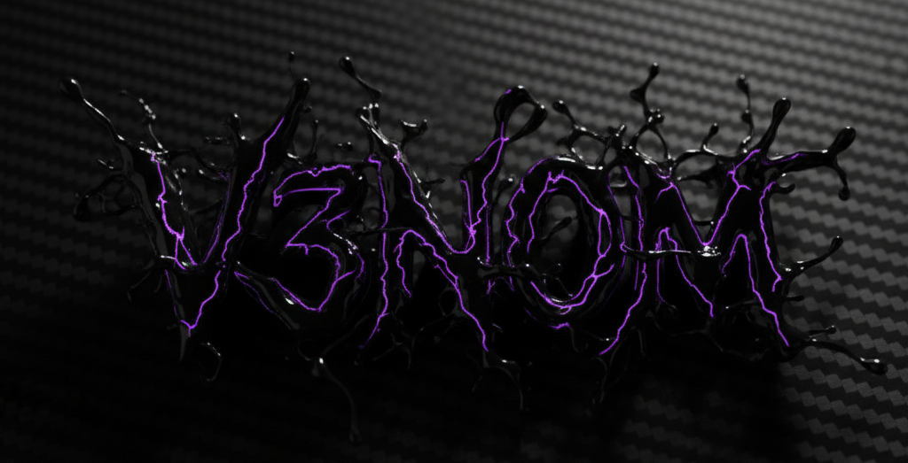

<p align="center">
  
</p>

[](https://python.org)
[](https://docker.com)
[](https://telegram.org)
[](LICENSE)

**Профессиональный VPN Bot с автоматическим деплоем, платежами YooKassa, интеграцией с X-UI и полным мониторингом.**

## ✨ Особенности

- 🔐 **Интеграция с X-UI** - автоматическое создание VPN клиентов
- 💳 **YooKassa платежи** - безопасные онлайн платежи
- 🤖 **Telegram Bot** - удобный интерфейс для пользователей
- 🐳 **Docker** - контейнеризация и легкий деплой
- 📊 **Мониторинг** - автоматические уведомления и метрики
- 🔄 **Автодеплой** - один скрипт для полной настройки
- 💾 **База данных** - SQLite с автоматическими бэкапами
- 🛡️ **Безопасность** - rate limiting, логирование, health checks

## 🏗️ Архитектура

```
vpnBot/
├── bot/                    # Основной код бота
│   ├── api.py             # API для работы с X-UI
│   ├── bot.py             # Главный файл бота
│   ├── callbacks.py       # Callback данные
│   ├── config.py          # Конфигурация
│   ├── db.py              # Работа с базой данных
│   ├── handlers.py        # Обработчики сообщений
│   ├── keyboards.py       # Клавиатуры
│   ├── middleware.py      # Middleware для бота
│   ├── metrics.py         # Сбор метрик
│   ├── monitor.py         # Мониторинг
│   ├── payments.py        # Платежи YooKassa
│   └── ui.py              # UI компоненты
├── deploy/                # Файлы для деплоя
│   ├── deploy.sh          # Автоматический деплой
│   ├── Dockerfile         # Docker образ
│   ├── docker-compose.yml # Docker Compose
│   ├── vpnbot.service     # Systemd сервис
│   └── DEPLOY.md          # Инструкции по деплою
├── utils/                 # Утилиты
│   ├── anomaly_check.py   # Проверка аномалий
│   ├── backup.sh          # Скрипт бэкапа
│   └── monitor.sh         # Мониторинг
├── images/                # Изображения
├── .gitignore            # Git ignore
├── env.example           # Пример конфигурации
├── requirements.txt      # Python зависимости
└── README.md            # Документация
```

## 🚀 Быстрый старт

### 1. Клонирование и подготовка

```bash
# Клонируем репозиторий
git clone https://github.com/eemiil/vpnBot.git
cd vpnBot

# Делаем скрипт деплоя исполняемым
chmod +x deploy/deploy.sh
```

### 2. Автоматический деплой

```bash
# Запускаем автоматический деплой (требует sudo)
sudo ./deploy/deploy.sh
```

**Скрипт автоматически:**
- Обновит систему
- Установит Docker
- Скопирует необходимые файлы
- Создаст .env из примера
- Настроит systemd сервис
- Настроит cron для мониторинга
- Создаст папки с правильными правами

### 3. Настройка конфигурации

```bash
# Редактируем .env файл
nano .env
```

**Обязательные параметры:**
```env
# Telegram Bot
BOT_TOKEN=your_bot_token_here
ADMIN_IDS=123456789,987654321

# X-UI Panel
XUI_URL=http://your-server:54321
XUI_USER=admin
XUI_PASSWORD=your_password

# YooKassa (опционально)
YOOKASSA_ACCOUNT_ID=your_account_id
YOOKASSA_SECRET_KEY=your_secret_key
USE_YOOKASSA=true
```

### 4. Запуск бота

```bash
# Собираем и запускаем контейнер
docker-compose build --no-cache
docker-compose up -d

# Проверяем логи
docker-compose logs -f
```

## 🐳 Docker

### Основные команды

```bash
# Запуск
docker-compose up -d

# Остановка
docker-compose down

# Перезапуск
docker-compose restart

# Логи
docker-compose logs -f

# Обновление
docker-compose pull
docker-compose up -d
```

### Volumes

- `./logs:/app/logs` - логи приложения
- `./backups:/app/backups` - бэкапы базы данных
- `usersdb:/app/users.db` - база данных (Docker volume)

## 🔧 Управление сервисом

### Systemd

```bash
# Запуск
sudo systemctl start vpnbot

# Остановка
sudo systemctl stop vpnbot

# Перезапуск
sudo systemctl restart vpnbot

# Статус
sudo systemctl status vpnbot

# Логи
journalctl -u vpnbot -f
```

### Docker Compose

```bash
# Запуск
docker-compose up -d

# Остановка
docker-compose down

# Перезапуск
docker-compose restart

# Логи
docker-compose logs -f
```

## 📊 Мониторинг

### Автоматические проверки

- **Каждые 5 минут**: проверка работоспособности бота
- **Каждый день в 2:00**: создание бэкапа базы данных
- **Health checks**: проверка доступности Telegram API

### Логи

```bash
# Логи приложения
tail -f logs/bot.log

# Логи платежей
tail -f logs/payments.log

# Логи Docker
docker-compose logs -f
```

## 🔐 Безопасность

- **Rate Limiting**: защита от спама
- **Admin Only**: ограниченный доступ к админ функциям
- **Logging**: полное логирование всех действий
- **Health Checks**: мониторинг состояния
- **Resource Limits**: ограничения памяти и CPU

## 🛠️ Разработка

### Установка зависимостей

```bash
pip install -r requirements.txt
```

### Структура кода

- **bot/bot.py** - главный файл с инициализацией
- **bot/handlers.py** - обработчики сообщений и callback'ов
- **bot/middleware.py** - middleware для логирования и rate limiting
- **bot/api.py** - API для работы с X-UI
- **bot/db.py** - работа с базой данных SQLite
- **bot/payments.py** - интеграция с YooKassa

### Добавление новых функций

1. Создайте обработчик в `bot/handlers.py`
2. Добавьте callback в `bot/callbacks.py`
3. Создайте клавиатуру в `bot/keyboards.py`
4. Зарегистрируйте в `bot/bot.py`

## 📝 Конфигурация

### Переменные окружения

| Переменная | Описание | Обязательная |
|------------|----------|--------------|
| `BOT_TOKEN` | Токен Telegram бота | ✅ |
| `ADMIN_IDS` | ID администраторов (через запятую) | ✅ |
| `XUI_URL` | URL X-UI панели | ✅ |
| `XUI_USER` | Пользователь X-UI | ✅ |
| `XUI_PASSWORD` | Пароль X-UI | ✅ |
| `YOOKASSA_ACCOUNT_ID` | ID аккаунта YooKassa | ❌ |
| `YOOKASSA_SECRET_KEY` | Секретный ключ YooKassa | ❌ |
| `USE_YOOKASSA` | Использовать YooKassa (true/false) | ❌ |

## 🐛 Устранение неполадок

### Проблемы с базой данных

```bash
# Очистка volumes
docker-compose down --volumes
docker-compose up -d
```

### Проблемы с правами

```bash
# Исправление прав
sudo chown -R 1000:1000 logs backups
```

### Проблемы с Docker

```bash
# Очистка системы
docker system prune -af
docker-compose build --no-cache
docker-compose up -d
```

## 📄 Лицензия

MIT License - см. файл [LICENSE](LICENSE)

## 🤝 Поддержка

Если у вас возникли вопросы или проблемы:

1. Проверьте [Issues](https://github.com/eemiil/vpnBot/issues)
2. Создайте новый Issue с подробным описанием
3. Приложите логи: `docker-compose logs`

## 🎯 Roadmap

- [ ] Web интерфейс для администрирования
- [ ] Поддержка других платежных систем
- [ ] Интеграция с другими VPN панелями
- [ ] API для внешних сервисов
- [ ] Расширенная аналитика

---

**Создано с ❤️ для удобного управления VPN сервисом**